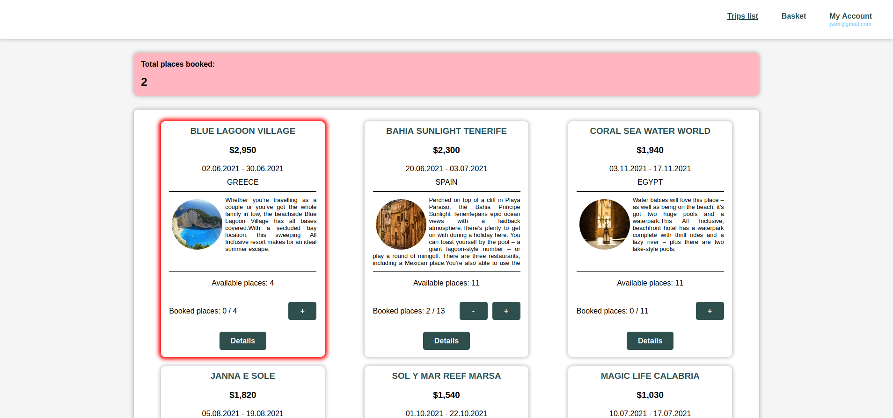
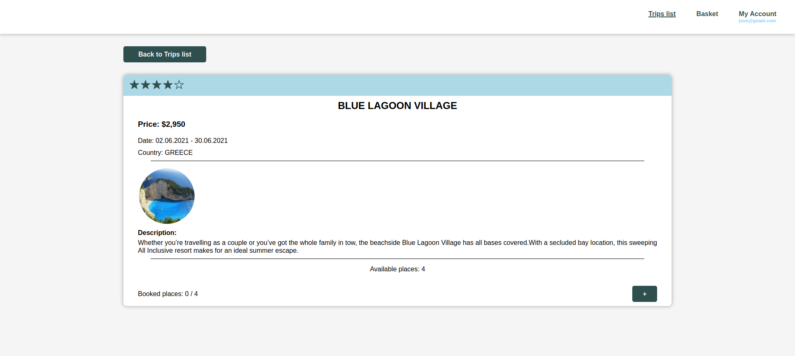
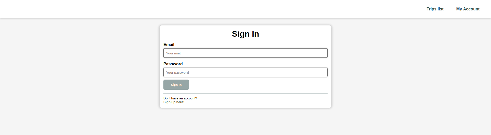
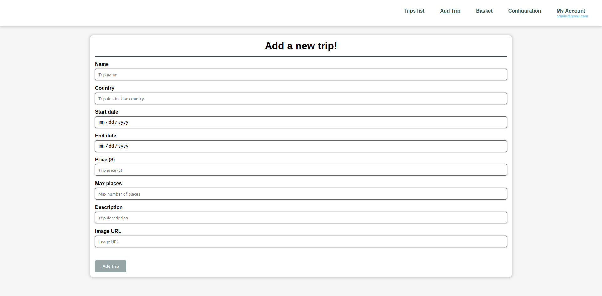
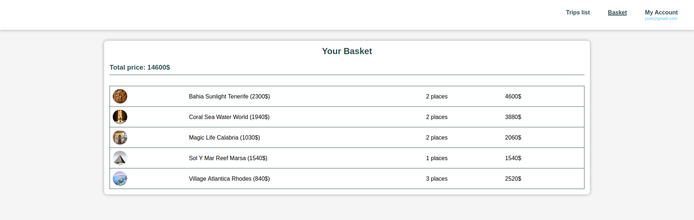
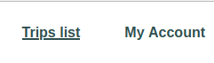
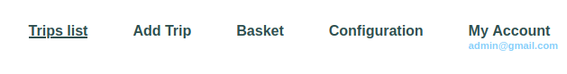

# TravelAgency - Projektowanie Aplikacji Internetowych

---

## Spis treści
* [Przegląd](#Przegląd)
* [Technologie](#Technologie)
* [Kluczowe komponenty](#Kluczowe-komponenty)
* [Kluczowe funkcjonalności](#Kluczowe-funkcjonalności)
* [Setup](#Setup)
* [Stan rozwoju aplikacji](#Stan-rozwoju-aplikacji)
* [Licencja](#Licencja)

## Przegląd
[TravelAgency](https://github.com/JakubNowobilski/TravelAgency) powstał jako część projektu zaliczeniowego z przedmiotu
Wprowadzenie do Aplikacji Internetowych. Oryginalnie aplikacja korzystała z bazy danych w chmurze:
Google [Firebase Realtime Database](https://firebase.google.com/docs/database). Na potrzeby przedmiotu
Projektowanie Aplikacji Internetowych zrezygnowane z tego rozwiązania i wprowadzono bardziej standardowe rozwiązanie
oparte o bazę dokumentową [MongoDB](https://www.mongodb.com/) oraz backend aplikacji zrealizowany w
[NodeJS](https://nodejs.org/en).
Aplikacja dostarcza funkcjonalność prostej agencji podróży. Pozwala na przeglądanie wycieczek oraz dokonywanie
rezerwacji. Funkcjonalności administratora obejmują dodawanie nowych wycieczek oraz ustawienie tryb persystencji
uwierzytelniania. Wszystkie oryginalne wymagania wobec aplikacji znajdują się w [wymaganiach projektu](project_requirements.txt).

## Technologie
* [Angular 11.2.11](https://v11.angular.io/docs)
* [AngularFire 6.1.4](https://github.com/angular/angularfire)
* [MongoDB](https://www.mongodb.com/)
* [NodeJS](https://nodejs.org/en)
* [Firebase Authentication](https://firebase.google.com/docs/auth)
* [Firebase Cloud Storage](https://firebase.google.com/docs/storage)

## Kluczowe komponenty
### Listing wycieczek

   
### Szczegóły wycieczki

### Ekran logowania

### Dodanie nowej wycieczki

### Koszyk

## Kluczowe funkcjonalności
* **Dostawca danych** - dane przechowywane są w dokumentowej bazie danych [MongoDB](https://www.mongodb.com/).
Przechowuje ona dane dotyczące wycieczek oraz użytkowników i ich ról. Obrazy przechowywane są w usłudze
[Firebase Cloud Storage](https://firebase.google.com/docs/storage).
* **Użytkownicy oraz uwierzytelnianie** - Użytkownicy uwierzytelniani są za pomocą usługi
[Firebase Authentication](https://firebase.google.com/docs/auth). Istnieją 4 rodzaje ról użytkownika:
  * **Gość** (użytkownik niezalogowany) - posiada najmniej uprawnień. Może jedynie przeglądać wycieczki.
  * **Czytelnik** (użytkownik zalogowany) - regularny użytkownik. Może przeglądać wycieczki oraz dokonywać rezerwacji.
Każdy może zarejestrować się jako ten typ użytkownika.
  * **Pracownik** (agencji podróży) - może dodawać nowe wycieczki. Wycieczki mogą być stworzone wyłącznie ręcznie.
  * **Administrator** - posiada wszystkie uprawnienia jak Pracownik. Dodatkowo może usuwać wycieczki oraz zarządzać
persystencją uwierzytelniania.
* **Widoki kontekstowe** - dodatkowe panele menu, przyciski oraz inne komponenty widocznej jedynie dla odpowiednich
typów użytkowników.

  |  |
  |:--------------------------------------:|
  |        *Panel nawigacji Gościa*        |

  |  |
  |:--------------------------------------:|
  |    *Panel nawigacji Administratora*    |

* **Strażnicy (Guards)** - strażnicy są skonfigurowani aby blokować dostęp do niektórych komponentów aplikacji
przed nieautoryzowanymi użytkownikami. Przykładowo Goście (niezalogowani użytkownicy) nie mają dostępu do widoku koszyka,
a jeśli spróbują przejść do strony koszyka poprzez wpisanie adresu URL koszyka zostaną przekierowani do strony
<em>nieznaleziono</em>.

## Setup
Jeśli chcesz samodzielnie użytkować aplikację, jest kilka kroków, które musisz wykonać aby uruchomić ją na swoim
urządzeniu.
1. Zarejestruj się do [Google Firebase](https://firebase.google.com/).
2. Skonfiguruj magazynowanie (cloud storage) i prześlij [przykładowe obrazy](assets/sample-pics).
3. W konsoli Firebase przejdź do ustawień projektu, znajdź odpowiednią konfigurację SDK i skopiuj ją do
[environment.ts](../src/environments/environment.ts) oraz [environment.prod.ts](../src/environments/environment.prod.ts).
4. Uruchom serwer MongoDB na porcie 27017
5. Przejdź do folderu [backend](../backend) i uruchom **npm install**
6. Aby dodać dane demo ([sample data](assets/sample-data.json)) uruchom **node drop_update_demo.js**
7. Uruchom serwer aplikacji za pomocą **node travel_agency_server.js**
8. Przejdź do folderu [fronted](../frontend) i uruchom **npm install**
9. Uruchom **ng serve**
10. Otwórz aplikację w przeglądarce pod adresem [localhost:4200](http://localhost:4200/)

## Stan rozwoju aplikacji

Praca nad projektem jest zakończona, ale poniżej przedstawionych jest kilka możliwość rozwoju aplikacji:
* Filtrowanie oraz sortowanie wycieczek
* Implementacja RWD (Responsive Web Design)
* Implementacja indywidualnych koszyków użytkownika
* Implementacja systemu ocen wycieczek  
* Przesyłanie obrazów wycieczek
* Stworzenie procesu rezerwacji wycieczek

## Licencja

Projekt jest licencjonowany pod warunkami [licencji](LICENSE.md) MIT.
